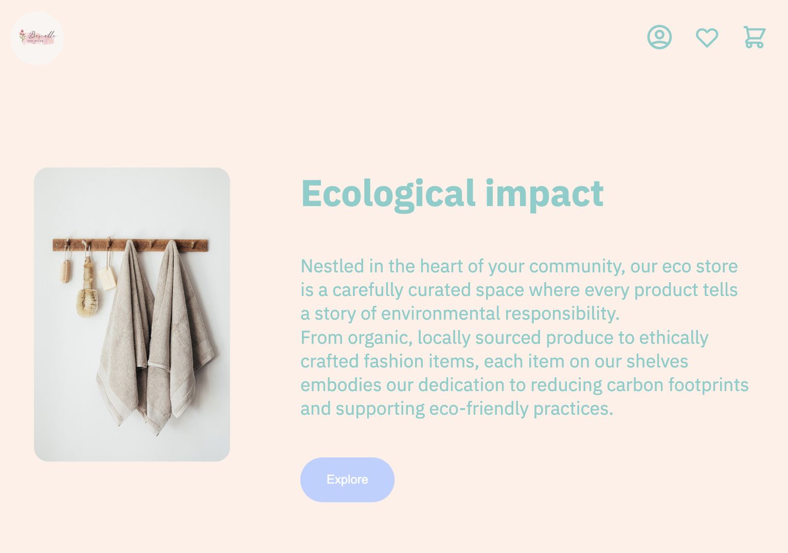

# Eco-Store E-Commerce Website


## Introduction

This is an [HTML5/ CSS3/ SASS] project. This project involves the creation of an e-commerce website for an eco-store specializing in the sale of organically crafted fashion items. The primary focus of this project was the implementation of Sass At-rules, with an emphasis on achieving a beautiful and minimalist design.

In this README, you will find information about the project, how to run it, and other relevant details.

## Table of Contents

- [Features](#features)
- [Technologies](#technologies)
- [Installation](#installation)
- [Usage](#usage)
- [Contributing](#contributing)
- [Credits](#credits)


## Features

- Introduction: An article-style section at the beginning, providing an overview of the eco-store and its mission.
- Product Cards: Two product card sections that showcase the fashion items. These product cards are designed with aesthetics in mind and allow for the inclusion of descriptions and photos.
- Gallery: A gallery section to display images related to the eco-store's products 
- Location Information: Information about the physical store location, including address, and a map for directions.
- Footer: A footer containing essential details such as contact information, social media links, and links to important pages within the website.

## Technologies

The project utilizes the following technologies:

- HTML5 and CSS3 for structuring and styling the web pages.
- Sass for efficient and maintainable CSS.
- Responsive design to ensure a seamless experience on various devices.
- Git for version control and collaboration.


## Installation

To run this project locally, follow these steps:

1. Clone the repository to your local machine:

   ```bash
   git clone [https://github.com/kathylangarano/eco-store.git]
   ```
   
2. Navigate to the project directory: 
   ```bash
    cd eco-store
    ```
3. Install project dependencies:
    ```bash
    npm install
    ```
## Usage

To run the project locally, use the following commands:

1. Start the development server:
   ```bash
   npm run dev
   ```
2. Open your web browser and navigate to [http://localhost:3000](http://localhost:3000)  to view the eco-store page.
   
To use this website, simply navigate through the sections to explore the eco-store's offerings and learn more about their commitment to sustainable fashion. 

## Contributing

If you would like to contribute to this project, please follow these guidelines:

1. Fork the repository on GitHub.
2. Create a new branch with a descriptive name.
3. Make your changes and ensure the code is well-documented.
4. Test your changes thoroughly.
5. Create a pull request to the main repository's main branch.

All the contributions are welcome to enhance and improve the functionality of this project. If you have ideas for adding interactivity, JavaScript enhancements, or any other features that can make this e-commerce website more professional and engaging, we encourage you to get involved.

## Credits

This project is based on the [Sass course] by [Platzi]([https://github.com/platzi]).

Thank you for your interest in our eco-fashion e-commerce website project!


